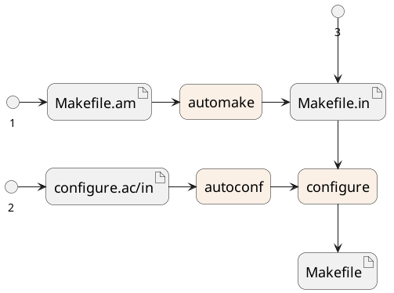

# install

to install from source:
```bash
$ ./configure && make && make install

$ tar xf package.tar.gz && ( cd package; ./configure && make && sudo make install ) && rm package -rf
```

to check install options, after `configure` is generated
```bash
$ ./configure --help
```

if needed, run autoreconf
```bash
$ autoreconf -f -i
```

## Files

- `Makefile.am` -- a user input file to `automake`
  - `automake` gererates `Makefile.in` from `Makefile.am`
- `configure.in` -- a user input file to `autoconf`
  - `autoconf` generates `configure` from `configure.in`
  - `configure` generates `Makefile` from `Makefile.in`

`Makefile.am` (the `.am` stands for automake) is a programmer-defined file and is used by automake to generate the `Makefile.in` (`.in` means that it's input for `configure`) file.

The `configure` script typically seen in source tarballs will use the `Makefile.in` to generate a `Makefile`.



## Tools

`autoconf` generates the configure script from various input files, some of which are created using other tools like `aclocal`, `automake`, etc.

`autoreconf` is a helper that knows how to call all these tools in the right order

You'll usually just call `autoreconf` yourself and let it deal with all the lower level tools ....

```bash
$ automake --help
Usage: /usr/bin/automake [OPTION]... [Makefile]...

Generate Makefile.in for configure from Makefile.am.

$ autoconf --help
Usage: /usr/bin/autoconf [OPTION]... [TEMPLATE-FILE]

Generate a configuration script from a TEMPLATE-FILE if given, or
'configure.ac' if present, or else 'configure.in'.  Output is sent
to the standard output if TEMPLATE-FILE is given, else into
'configure'.

$ autoreconf --help
Usage: /usr/bin/autoreconf [OPTION]... [DIRECTORY]...

Run 'autoconf' (and 'autoheader', 'aclocal', 'automake', 'autopoint'
(formerly 'gettextize'), and 'libtoolize' where appropriate)
repeatedly to remake the GNU Build System files in specified
DIRECTORIES and their subdirectories (defaulting to '.').
```

## Tools more

The `configure` shell script attempts to guess correct values for various system-dependent variables used during compilation.
It uses those values to create a `Makefile` in each directory of the package.
It may also create one or more `.h` files containing system-dependent definitions.
Finally, it creates a shell script `config.status` that you can run in the future to recreate the current configuration,
and a file `config.log` containing compiler output (useful mainly for debugging `configure`).

The file `configure.ac` (or `configure.in`) is used to create `configure` by a program called `autoconf`.
You need `configure.ac` if you want to change it or regenerate `configure` using a newer version of `autoconf`.

> To check options run `./configure --help`
